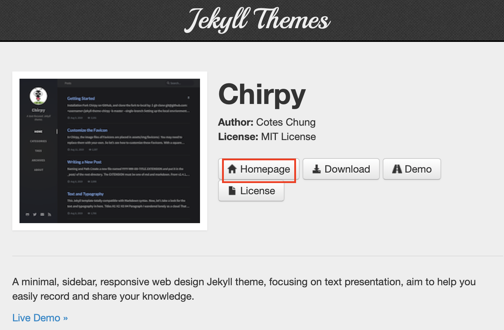

# Github 블로그 만들기

## ▷ Step 1. Repository Setting

### 1-1. Repository 생성

<br/>

먼저, Github에서 빈 레포지토리 하나를 생성한다.  
이름은 `username.github.io` 로 한다. (ex. codeztree.github.io)  

### 1-2. Repository를 Clone하고 인덱스 페이지를 만들기

<br/>

* 터미널에 다음과 같이 입력해준다.
```
git clone https://github.com/username/username.github.io
cd username.github.io
echo "Hello World" > index.html
git add --all
git commit -m "Initial Commit"
git push -u origin master
```
* 이제 `username.github.io` 에 접속해보면 페이지가 정상적으로 뜨는 것을 확인할 수 있다.

<br/>

## ▷ Step 2. Jekyll Theme 적용

### 2-1. 원하는 Jekyll Theme 찾기

<br/>

먼저 자신이 마음에 드는 Jekyll Theme를 찾는다. [Jekyll Themes][jeky-site]에 들어가 보면 다양한 테마들이 존재하므로 원하는 테마를 선택하고 해당 Github Repository로 들어간다.  



[jeky-site]: http://jekyllthemes.org  

<br/>

### 2-2. `_config.yml` 가져오고 설정하기

<br/>

해당 Github Repository에서 `_config.yml` 파일을 그대로 복사해 자신의 `github.io` Repository에 붙여 넣어준다.  
<br/>
해당 작업 수행 후, 복사한 파일에 다음과 같은 작업을 진행한다.  

<br/>

* 다음 두 줄을 다음과 같이 수정해준다.
```yml
url       : "https://username.github.io"
baseurl   : ""
```
baseurl은 공백(`""`)으로 해준다. Subpath를 설정하고 싶다면 설정해도 상관없다.

이외의 내용은 본인에 맞게 수정해주어도 상관 없다. (페이스북, 홈페이지, 이메일 등등)  

<br/>

###### Remote Theme
<details><summary>사용법</summary>
<p>

* 다음 한 줄을 추가해준다.
```yml
remote_theme: Owner/Repository
```
(여기서 Owner은 Theme Repository 소유자의 이름, Repository는 Theme Repository의 이름이다. ex) `codeztree/lovelytheme`)

* Remote Theme를 사용하게 되면, Theme의 다른 `css`, `_layout` 같은 리소스를 전체 다 가져올 필요 없이 Github가 자동으로 해당 테마 레포지토리의 정보를 확인해 정리해주므로 간단하다. 하지만 커스터마이징을 할 수 없다.)
</p>
</details>

<br/>

### 2-3. `index.html` 가져오기
<br/>

선택한 Theme Repository에서 `index.html`파일을 가져와 자신의 Repository에 넣어준다. 이 파일은 Jekyll이 사이트 생성시 가장 처음으로 보여주는 페이지이다.

테마에 따라서는 필요한 파일이 더 있을 수 있다. 그런 경우, 해당 파일을 모조리 복사해서 붙여넣기 해준다.

### 2-4. Check the Page

<br/>

`https://username.github.io`에 들어가서 페이지가 원활히 작동이 잘 되는 지 확인한다.

<br/>

## ▷ Step 3. Post에 글쓰기

### 3-1. `_posts` 폴더 만들기

<br/>

대부분의 경우라면 예시 post를 위해 `_posts` 폴더가 Repository 내에 존재할 것이다. 만약 그렇지 않다면, Repository 바로 안에 `_posts` 폴더를 만들어 준다.

<br/>

### 3-2. Markdown Post 파일 생성하기

<br/>

* Jekyll는 `_posts` 폴더 아래의 Mardown 문서를 인식하고 이를 글로 보여준다. 파일 이름은 일반적으로 `YYYY-MM-DD-nameOfPost.md` 형식으로 짓는다.

* 파일 맨 처음에는 글의 제목이나 날짜를 적어준다. `Front-Matter` 라고 불리는 이 형식은 Jekyll가 글에서 메타데이터를 확인하는데 사용한다. 테마별로 예시가 다르므로, 테마별로 정보를 확인하기 바란다.
```yml
 ---
title: "Hello, World!"
date: 2021-5-13 06:15:32 -0400
categories: new jekyll
 ---
```

* `Front-Matter` 뒤에는 본인이 작성하고 싶은 내용을 자유롭게 Markdown 형식으로 작성하면 된다.

<br/>

## ▷ Step 4. 테마 커스터마이징

만약 테마가 `_layouts`, `_include`, `assets` 등의 리소스를 포함한다면 그것들을 약간만 손보는 정도로 편리하게 테마를 커스터마이징 할 수 있다. 만약 해당 리소스가 없다면, 해당 폴더를 생성하고 파일을 만들어 자신만의 테마를 적용할 수 있다. (Jekyll는 이 폴더들에서 커스텀 테마를 읽어들인다.)

만약 커스터마이징이 필요 없다면, `jekyll remote theme`를 간단하게 사용하는 방법도 있다.

\> \> [Jekyll Remote Theme 사용](#remote-theme)
